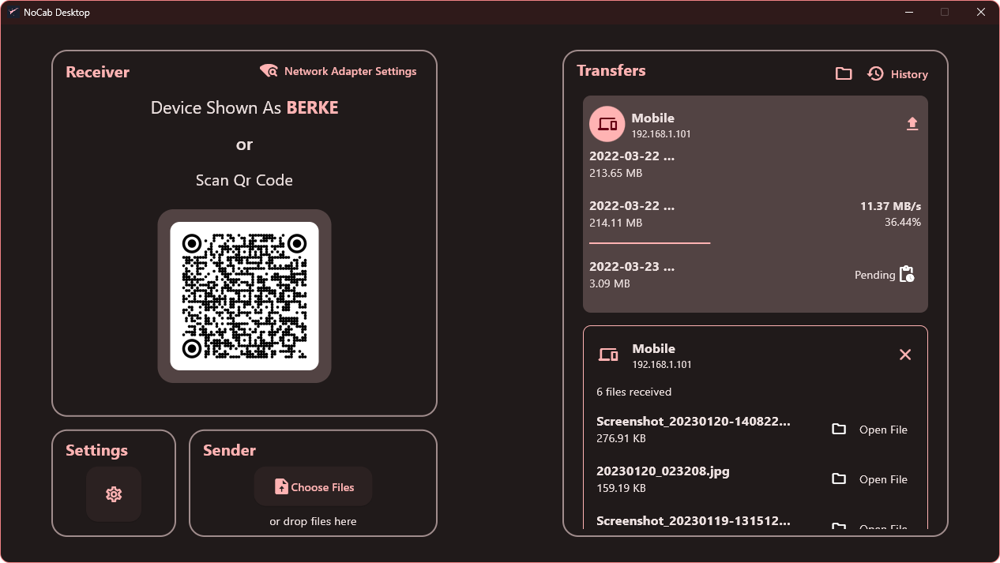
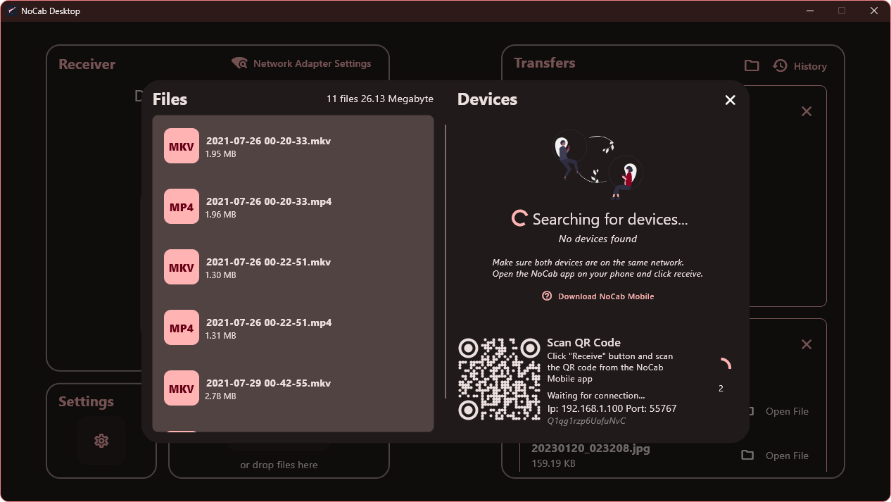
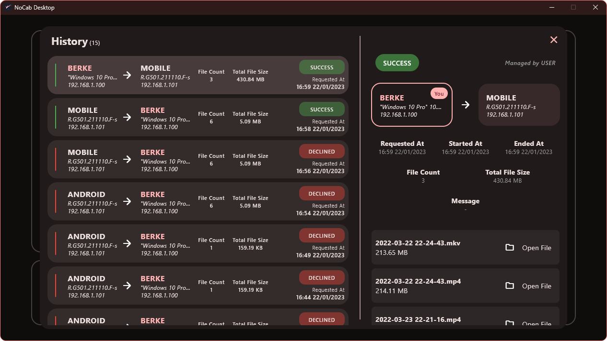
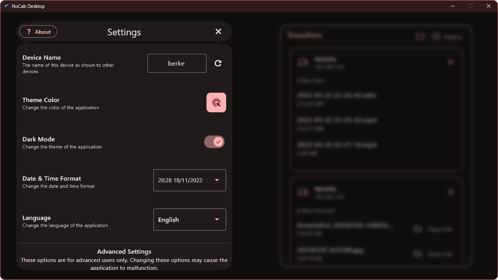

<h1 align="center">
</a>
     
<b>NoCab Desktop</b>
</h1>

    NoCab Desktop is NoCab Client for desktop file transfer.

    If you tired to carrying unnecessary cables or sending files to empty whatsapp groups. NoCab Transfer is for you! You can transfer all your files between your phone and your computer and your files will not be sent any other server. Just you and your devices 🤫

  
  

 

</a>

## Minimum Requirements
* Windows 10 1903 or later
* Android 5.0 or later [_(NoCab Mobile)_](https://github.com/nocab-transfer/nocab-mobile)
* A network that both devices are connected to

## Installing
> **Note**: Unfortunately there is no Linux or MacOS Application. For Windows keep reading.

### 1. Installing MSIX using PowerShell
* Right click the Windows button and select PowerShell or Terminal.
* Run the following command \
    `irm https://get-nocab.netlify.app | iex`
* Wait for the installation to complete
* You can now use the NoCab 🥳🚀

> **Note**: What is `get-nocab.netlify.app`? Read more about it [here](https://github.com/nocab-transfer/nocab-desktop/wiki/Possible-Questions#so-what-is-get-nocabnetlifyapp)

### 2. Downloading Portable Version
* Download the `nocab_desktop-win64-portable.zip` from [here](https://github.com/nocab-transfer/nocab-desktop/releases/latest)
* Extract the zip file to a folder
* Run the nocab_desktop.exe file
* Now you are ready to go 🥳🚀

> **Note**: We recommend you to use the MSIX version. Read more about why [here](https://github.com/nocab-transfer/nocab-desktop/wiki/Why-you-should-use-MSIX%3F).

 
<h1 align="center">
ScreenShots
</h1>

<table align= "center">
    <tr>
        <td colspan>
            
Transfer List

            
        </td>
        <td colspan>
            
Send Dialog

            
        </td>
    </tr>
    <tr>
        <td colspan>
            
History

            
        </td>
        <td colspan>
            
Settings

            
        </td>
    </tr>
</table>